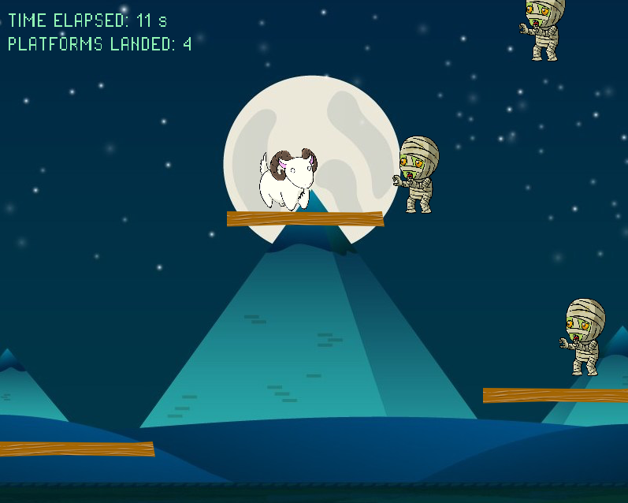
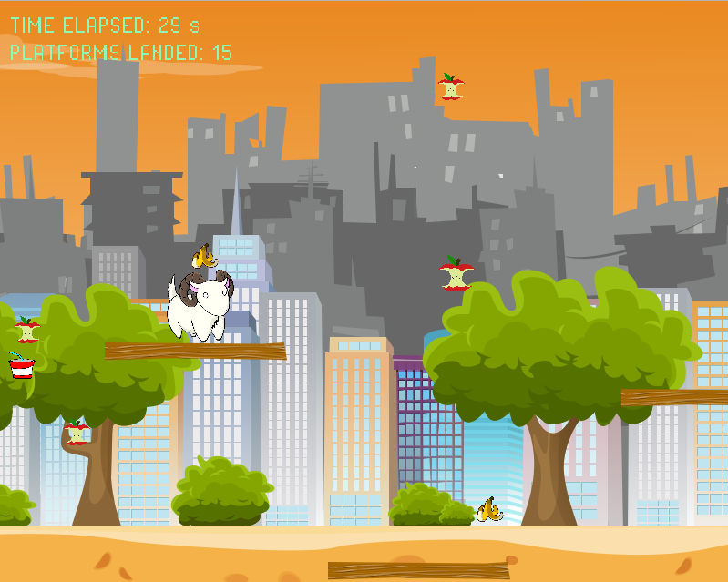
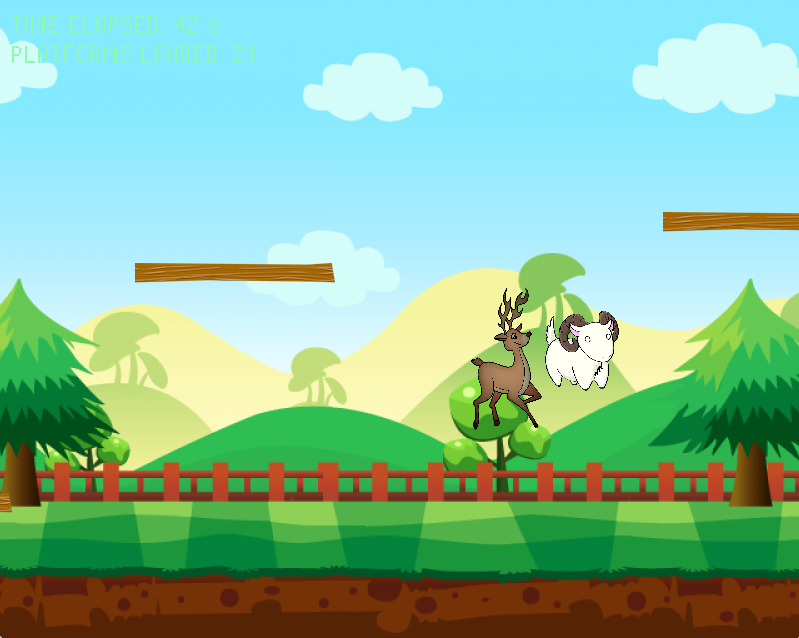
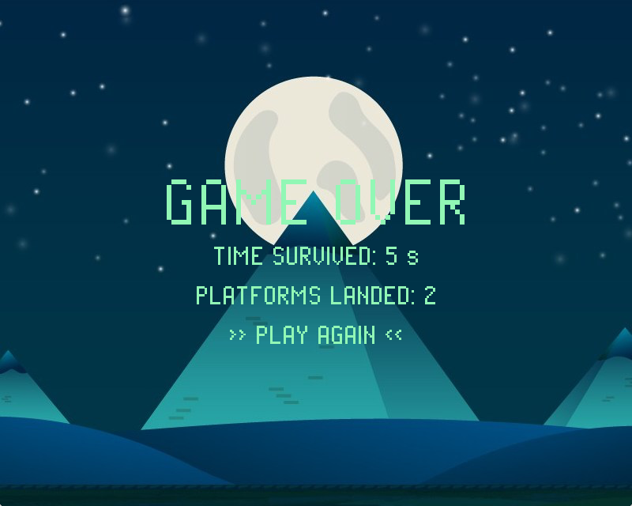

# GoatJumper
**Collaborators**: Kimberly Nguyen, Max Mindel, Jason Fiammetta, Jerry Leung 

**Course Website**: https://cs3520.weebly.com 

## Introduction
GoatJumper is an endless platformer where the goal is to survive as long as 
possible. The user controls a goat via the arrow keys and can double jump 
by pressing the "up" arrow key twice. Double jumps reset when the user hits a 
platform or an enemy. 

There are three different maps, which rotate as the game progresses. Each map 
has a different set of enemies. The speed and quantity of the platforms and 
enemies increase over time.
 
 
 

The game ends when the goat falls off the bottom edge of the screen, after 
which the "Game Over" screen is displayed. There are two measures of score: 
the duration that the user survived and the number of platforms on which the 
user landed. The user can restart the game by clicking "Play Again." 
 

## Directories
- **[ASSGN3](ASSGN3/)**: our demo for Assignment 3
- **[ASSGN4](ASSGN4/)**: our work for Assignment 4
- **[ASSGN6](ASSGN6/)**: our work for Assignment 6
- **[game](game/)**: our main project
- **[lib](lib/)**: all of the libraries/frameworks used in our project
- **[misc](misc/)**: additional files corresponding to the IDEs that we used 
(Visual Studio and XCode)
- **[screenshots](screenshots/)**: screenshots of our game

## Files
- **[sync_xcode.sh](sync_xcode.sh)**: script used to move [XCode files](misc/xcode/game/Game/) to [game](game/)
- **[sync_vs.sh](sync_vs.sh)**: script used to move [Visual Studio files](misc/visual_studio/Game/Game/) to [game](game/)

## Contributions
- **Kimberly**: managed/organized the repository and helped everyone with Git, 
wrote the OpenGL portion of the demo for ASSGN3, wrote the write-up and helped 
Max with the UML diagram for ASSGN4, updated the UML diagram with the complete 
classes after finishing the project, handled the code relating to the view 
(primarily working with the SDL library), wrote the `ObjState` class to connect 
the view and the controller, added reset functionality for when the game ends, 
added score measures
  - **Coded**: [`GameController.hpp`](/game/GameController.hpp)/
  [`.cpp`](/game/GameController.cpp), [`IView.hpp`](/game/IView.hpp), 
  [`Map.hpp`](/game/Map.hpp)/[`.cpp`](/game/Map.cpp), 
  [`ObjState.hpp`](/game/ObjState.hpp), [`Posn.hpp`](/game/Posn.hpp), 
  [`SDLView.hpp`](/game/SDLView.hpp)/[`.cpp`](/game/SDLView.cpp), 
  [`TextureManager.hpp`](/game/TextureManager.hpp)/[`.cpp`](/game/TextureManager.cpp) 
  (Max rewrote `loadTextures()` to make it more efficient), 
  [`WorldState.hpp`](/game/WorldState.hpp)/[`.cpp`](/game/WorldState.cpp), 
  [`main.cpp`](/game/main.cpp)
- **Max**: wrote the Box2D portion of the demo for ASSGN3, designed the structure 
of our game/created the UML diagram for ASSGN4, helped Kimberly with the write-up 
for ASSGN4, handled the code relating to the model and controller (primarily 
working with the Box2D library to create the player, platform, enemy, and obstacle 
objects and handle collision-detection) and the code that connects them, wrote the 
logic for changing maps
  - **Coded**: [`Enemy.hpp`](/game/Enemy.hpp)/[`.cpp`](/game/Enemy.cpp), 
  [`GameObj.hpp`](/game/GameObj.hpp)/[`.cpp`](/game/GameObj.cpp), 
  [`IKeyListener.hpp`](/game/IKeyListener.hpp), [`IWorld.hpp`](/game/IWorld.hpp),
  [`Obstacle.hpp`](/game/Obstacle.hpp)/[`.cpp`](/game/Obstacle.cpp), 
  [`Platform.hpp`](/game/Platform.hpp)/[`.cpp`](/game/Platform.cpp), 
  [`Player.hpp`](/game/Player.hpp)/[`.cpp`](/game/Player.cpp), 
  [`World.hpp`](/game/World.hpp)/[`.cpp`](/game/World.cpp)
- **Jason**: wrote the `ISoundListener` interface to add background music and 
sound effects for when the player jumps (primarily working with the SDL_Mixer 
library)
  - **Coded**: [`ISoundListener.hpp`](/game/ISoundListener.hpp), 
  [`SoundListener.hpp`](/game/SoundListener.hpp)/[`.cpp`](/game/SoundListener.cpp)
- **Jerry**: created the sequence diagram, pair-programmed with Jason

We also all contributed to the project proposal.
